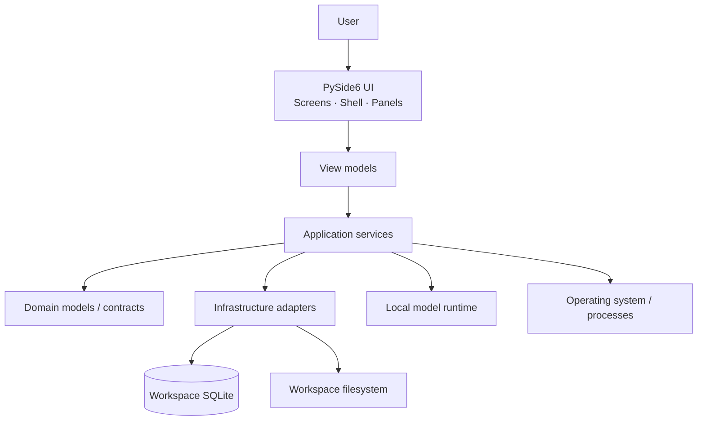
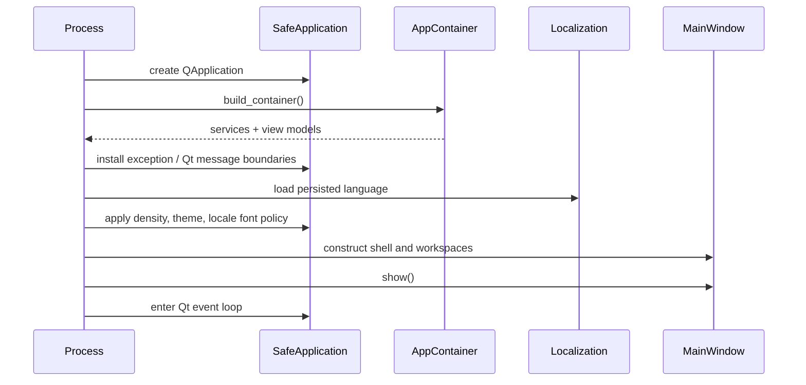
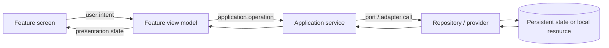

# Architecture Overview

This document describes the v1.0 architecture of Persona Training Lab (PTL) as implemented in the audited codebase.

It is a map of responsibilities and boundaries, not a line-by-line source tour. Use it to understand where behavior belongs, how state moves through the application, and which subsystems own persistence, long-running work, and user interaction.

## 1. Architectural shape

PTL is a local desktop application with a layered architecture:



The dominant dependency direction is from UI toward application behavior and from application behavior toward ports/adapters. SQLite, filesystem, telemetry, and process execution are infrastructure concerns rather than UI responsibilities.

## 2. Composition root

`persona_training_lab.bootstrap.wiring.build_container()` is the main composition root.

At startup it:

1. creates `AppSettings`;
2. resolves the platform-stable workspace paths;
3. ensures workspace directories exist;
4. configures structured logging under the workspace;
5. opens the SQLite database and creates/evolves the current schema;
6. creates persistence repositories;
7. creates error reporting, runtime-operation coordination, and lineage safety services;
8. recovers orphaned runtime operations left by a dead process;
9. creates application services;
10. creates view models;
11. returns an `AppContainer` consumed by the desktop bootstrap.

The composition root is intentionally explicit. It is the place where concrete adapters are selected and wired into application-facing services.

## 3. Desktop bootstrap

`persona_training_lab.bootstrap.app.main()` owns the application startup sequence.

The sequence is, conceptually:



The desktop bootstrap also connects application shutdown to `MainWindow.shutdown_background_work`, so owned background activity is given an explicit shutdown path rather than relying on object destruction alone.

## 4. UI shell

The main UI is a `QMainWindow` containing three spatial layers:

- a left `Sidebar` for navigation and shell controls;
- a central `WorkspaceStack` containing the active feature screen;
- movable/closable/floating dock panels for operational context.

The registered v1.0 workspaces are:

- Dashboard
- Profiles
- Agents
- Datasets
- Training
- Snapshots
- Tests
- Analysis
- Style
- Automation
- Key bindings
- Documentation

The registered docks are:

- Inspector — right side by default;
- Activity — bottom;
- Telemetry — bottom;
- Issues — bottom.

Activity, Telemetry, and Issues are tabified in the lower dock area. The shell menu for these panels is exposed through the sidebar rather than a permanently visible menu bar.

The shell is responsible for navigation, dock composition, status presentation, theme application, and workspace leave checks. Feature-specific business behavior belongs below the shell.

## 5. Screen → view-model → service flow

A typical interactive path looks like this:



Screens should not become persistence owners. View models translate application data into presentation-oriented state; application services coordinate use cases; repositories/providers isolate concrete I/O.

## 6. Application services

The composition root currently wires services for the major product areas, including:

- projects;
- profiles;
- agents;
- datasets;
- experiments/evaluation;
- model versions;
- local-model probing;
- training;
- automation;
- telemetry;
- style preferences;
- documentation;
- runtime operations;
- lineage runtime safety;
- operations-center reporting.

This is why the UI can expose multiple feature workspaces while sharing one persistent workspace and one set of operational safety mechanisms.

## 7. Persistence architecture

PTL uses one SQLite database per workspace: `app.db`.

The database is initialized by `create_minimal_schema()` and accessed through focused repositories rather than a single general-purpose data-access object.

Major persisted areas include:

- UI preferences;
- event log;
- projects;
- persona profiles;
- agents;
- experiments;
- datasets;
- training runs and training logs;
- analysis results;
- model versions;
- runtime operations and their resource claims;
- lineage resource links.

The schema initializer is also responsible for compatibility additions for columns/tables introduced after the earliest schema shape. The current codebase therefore treats schema creation and limited in-place evolution as startup responsibilities.

For table-level details, see the persistence specification later in the v1.0 documentation set.

## 8. Workspace filesystem

The SQLite database is only one part of the workspace. PTL also owns filesystem areas for artifacts, exports, temporary data, cache, logs, automation recipes, and model/training outputs.

The default root is independent from the process current working directory. This is a v1.0 integrity requirement: launching PTL from a different folder must not silently create a different application database beside the source code or shell script.

See [Workspace & Storage](../operations/workspace-and-storage.md) for the concrete platform paths and lifecycle rules.

## 9. Runtime-operation coordination

Long-running or destructive work is not treated as an uncoordinated background side effect.

`RuntimeOperationCoordinator` persists operations and resource claims. A claim identifies:

- `resource_kind`;
- `resource_id`;
- access mode: `read` or `write`.

Conflict semantics are:

- concurrent reads for the same resource are allowed;
- a write conflicts with another read or write for the same resource;
- deletion checks treat any active claim on the protected resource as a blocker.

Operations have persistent lifecycle states. Active states include `starting`, `running`, and `cancelling`; terminal states include `succeeded`, `failed`, `cancelled`, and `abandoned`.

On startup PTL inspects active operations and marks operations owned by dead process IDs as abandoned. This prevents a process crash from leaving permanent logical leases that block future work forever.

## 10. Lineage safety

Agents lineage is not just a drawing surface. It is backed by persistent projections and resource-safety rules.

The composition root provides:

- a SQLite lineage projection loader factory;
- `LineageRuntimeSafety`;
- the shared runtime-operation coordinator;
- lineage resource-link persistence.

This allows lineage views and destructive branch operations to reason about real persistent resources and active work instead of treating the graph as an isolated UI model.

Detailed lineage/history/deletion contracts are documented separately because they are one of the densest subsystems in PTL.

## 11. Automation architecture

Automation is wired as an application service with:

- a filesystem recipe provider rooted in the workspace;
- the shared runtime-operation coordinator;
- the workspace root;
- an audit trail backed by the event log.

Automation therefore participates in the same workspace and operational model as the rest of PTL. It is not an unrelated shell-command widget attached to the UI.

Automation remains an execution boundary: user-approved commands run with the permissions of the PTL process and operating-system account. The product controls execution lifecycle and audit metadata; it is not a security sandbox for arbitrary untrusted commands.

## 12. Local models and training

Local-model capability is split between application-facing services and optional model libraries.

The composition root wires:

- `FilesystemLocalModelProbeProvider` for local-model discovery/inspection;
- `LocalModelService` for application-facing model state;
- `LocalFullFineTuneBackend` rooted in the workspace artifacts directory;
- `TrainingService` for run coordination and publication of resulting state.

Inference/training dependencies are optional installation extras. The core desktop application does not require the complete training stack merely to launch.

Production model loaders do not enable `trust_remote_code=True`; model repositories are therefore not intentionally granted arbitrary repository-supplied Python execution through that Transformers mechanism.

## 13. Telemetry and operational visibility

Telemetry is composed from:

- a psutil-based system provider;
- an NVIDIA-SMI GPU provider when available;
- `SystemTelemetryService`;
- `TelemetryViewModel`;
- the Telemetry dock.

Operational information is distributed across four supporting surfaces:

- Inspector — context for the active workspace;
- Activity — active/recent work presentation;
- Issues — surfaced problems;
- Telemetry — system/GPU observations.

The Operations Center service combines event-log and runtime-operation data for a system-level operational view.

## 14. Error boundaries

PTL installs explicit process-level error boundaries for:

- uncaught Python exceptions on the main thread;
- uncaught Python worker-thread exceptions;
- Qt diagnostic messages.

These feed the application error reporter and event-log infrastructure rather than relying only on terminal stderr output.

This does not make arbitrary failures recoverable. It makes failure reporting and diagnosis part of the application architecture.

## 15. Localization and layout direction

Localization is runtime-switchable and catalog-driven. Complete v1.0 UI catalogs exist for Arabic, English, Spanish, and Russian.

A critical architectural rule is that text direction and shell geometry are separate concerns:

- shell/workspace geometry remains stable;
- localized text leaves may receive RTL direction where appropriate;
- machine-oriented values such as paths and identifiers remain LTR when the displayed content is LTR;
- Arabic rendering uses bundled Noto Sans Arabic UI fonts rather than depending on an arbitrary host fallback.

See [Localization architecture](localization.md) for the detailed contract.

## 16. Source-tree and release integrity

PTL's release policy treats the recorded Git tree as an execution input.

Ignored/untracked runtime-affecting files under `src/`, `tests/`, or `tools/` are blocked by release-policy tests because an editable checkout must not silently execute code or assets that are absent from a clean clone or wheel.

This policy exists because the final code audit found a real hidden-source failure mode. It is now part of the permanent regression contract.

## 17. What architecture documentation does not claim

This document describes the audited v1.0 architecture and the operating contracts proven before the documentation phase.

It does **not** claim that PTL has already completed the post-v1.0 stress campaign. The stress phase is intentionally a later engineering program intended to discover scale, duration, fault-injection, resource-exhaustion, and concurrency limits that may require significant new work.

The v1.0 architecture is therefore a stable product baseline, not a claim of having explored every failure envelope.

## 18. Source landmarks

When reading the code, start here:

```text
src/persona_training_lab/
├── bootstrap/
│   ├── app.py                 # desktop startup / process boundaries
│   └── wiring.py              # composition root
├── config/                    # settings and workspace paths
├── application/               # use cases, services, runtime coordination
├── domain/                    # domain types and semantics
├── infrastructure/           # SQLite, filesystem, telemetry adapters
├── i18n/                     # catalogs and localization audit
└── ui/
    ├── shell/                 # MainWindow, sidebar, workspace shell
    ├── viewmodels/            # presentation-facing state/adapters
    └── <feature>/             # feature screens and UI components
```

The architecture documents under `docs/architecture/` define the public explanatory model; source layout is evidence for that model, not a substitute for it.
