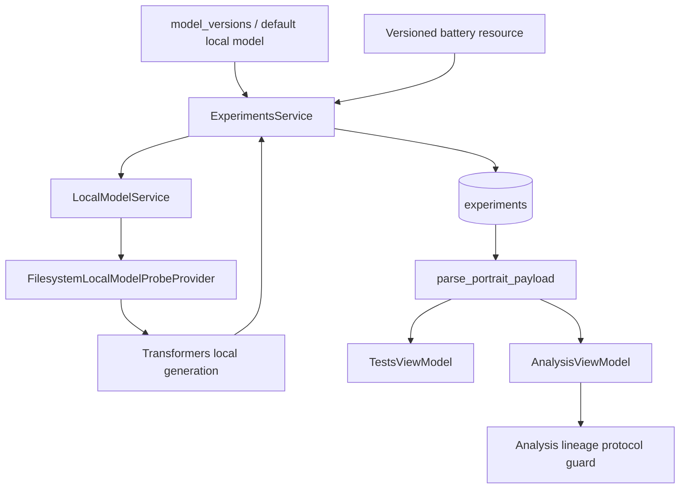

# Evaluation contract

This document defines the current v1.0 machine and interpretation contract for Persona Training Lab's portrait evaluation and Analysis workflow.

It is written for developers, auditors, operators, and researchers who need to know exactly what is executed, what is persisted, what is calculated, and what PTL does **not** claim.

For the end-user workflow, see [Tests and Analysis](../user-guide/tests-and-analysis.md).

## 1. Scope

The contract covers:

- portrait battery loading;
- model-version target resolution;
- local inference execution;
- score recognition;
- case/run status semantics;
- persistence into `experiments`;
- portrait payload parsing;
- reverse scoring;
- factor KPI calculation;
- automatic latest-versus-previous comparison;
- exact lineage version-to-version comparison;
- protocol comparability enforcement;
- known v1.0 reproducibility and methodology boundaries.

It does not define Training, Dataset approval, model-version creation, or Automation beyond the context required to understand evaluation inputs.

## 2. Architectural boundary

The current flow is:



The execution and analysis layers are intentionally separated.

`ExperimentsService` performs inference and persistence.

`AnalysisViewModel` and its lineage specialization derive read-only presentation/calculation from persisted experiment records.

## 3. Canonical built-in protocol identity

The current built-in portrait resource is:

```text
persona_training_lab.application.experiments.test_batteries/
    big_five_short_v1.jsonl
```

Each item declares protocol metadata including:

```text
battery_version
instrument
scoring_version
trait
key
statement/item
reverse
scale_min
scale_max
response_format
```

For the current bundled battery:

```text
battery_version = big_five_short_v1
instrument      = BIG_FIVE_SHORT
scoring_version = big_five_score_v1
scale           = 1..5
response_format = SCORE: <1-5>
```

The battery currently contains ten items.

## 4. Current factor/item inventory

The protocol tracks five factors with two items each:

```text
Extraversion         E1, E2R
Agreeableness        A1, A2R
Conscientiousness    C1, C2R
Emotional Stability  S1, S2R
Openness             O1, O2R
```

The second item in each pair is currently reverse-scored.

The scoring implementation does not infer reversal from the `R` suffix. It uses the explicit persisted/test-case `reverse` boolean.

## 5. Battery loading contract

`load_portrait_test_cases(...)` reads the packaged JSONL resource line by line.

Blank lines are ignored.

Each non-empty line must parse as JSON and provide at least:

```text
battery_version
instrument
scoring_version
trait
key
item
```

Optional/defaulted fields include:

```text
reverse         -> false
scale_min       -> 1
scale_max       -> 5
response_format -> SCORE: <1-5>
```

If a required key is missing, loading fails with a line-specific `ValueError`.

An empty battery is rejected.

A battery-loading exception is converted into the stable experiment result code:

```text
battery_load_failed
```

## 6. Versioning rule

A change that alters the scientific meaning of a portrait protocol should not silently reuse the same protocol identity.

At minimum, one or both of these identifiers must change as appropriate:

```text
battery_version
scoring_version
```

Examples that should normally imply a new battery and/or scoring identity include:

- changed item wording;
- changed item language;
- added/removed items;
- changed reverse flags;
- changed factor assignment;
- changed numeric scale;
- changed score normalization;
- changed factor aggregation rule.

The current v1.0 runtime compares identifiers, not battery file hashes. Version discipline is therefore part of the protocol trust boundary.

## 7. Model target resolution

`run_personality_portrait_test_pack(model_version_id=None)` obtains model versions when a `ModelVersionsService` is available.

Target selection behaves as follows.

### Explicit model version

If `model_version_id` is provided, PTL searches the loaded model-version registry for that exact ID.

If not found:

```text
message_code = model_version_not_found
```

No different model version is substituted.

### No explicit model version

If versions exist, PTL selects the first returned version.

The normal repository ordering makes this the most recently updated registry entry.

If no version is selected, evaluation uses the configured default local model path.

## 8. Artifact/model path selection

When a selected model version has a non-empty `artifact_path`, evaluation uses that path.

Otherwise it uses the configured `LocalModelService.model_path`.

Before running the battery, PTL probes the selected path.

If the selected registered artifact is unavailable:

```text
message_code = selected_weights_unavailable
```

If no registered version is selected and the default model path is unavailable:

```text
message_code = model_unavailable
```

These are pre-execution failures. They do not create a partial questionnaire result.

## 9. Runtime operation ownership

When a runtime operation coordinator is present, a portrait run begins with resource claims.

Always-requested claims include:

```text
ResourceClaim("experiment", experiment_id, "write")
ResourceClaim("model_path", model_path, "read")
ResourceClaim("compute_device", "local_inference", "write")
```

For a registered version, PTL can additionally claim:

```text
ResourceClaim("model_version", version_id, "read")
ResourceClaim("artifact_path", artifact_path, "read")
```

The operation kind is:

```text
personality_test
```

The subject kind is:

```text
experiment
```

A conflict produces:

```text
message_code = resource_busy
```

and the questionnaire is not executed.

## 10. Experiment identifiers

A new portrait run creates an ID:

```text
evr_<8 hex characters>
```

The ID is generated before the runtime lease begins so it can serve as operation subject/resource identity.

## 11. Item prompt contract

Each battery item produces a user prompt equivalent to:

```text
Насколько это похоже на твой обычный стиль ответа?
<statement>

Шкала 1-5: 1=нет, 3=средне, 5=да. Верни только: SCORE: <1-5>.
```

A dedicated instruction prompt tells the language model to:

- complete a scored research questionnaire;
- choose one numeric score;
- return one line `SCORE: N`;
- use an integer from 1 to 5;
- provide no explanation;
- not continue item text;
- not emit thinking tags.

The evaluation protocol is currently Russian at the questionnaire/user-prompt level even when the UI locale is different.

## 12. Local inference provider contract

`LocalModelService.generate_at(...)` first probes model files.

If the model files are not available, it returns a local-model result with status:

```text
not_loaded
```

Otherwise it delegates to the configured local model probe provider.

The current filesystem/Transformers provider loads:

```text
AutoTokenizer.from_pretrained(model_path)
AutoModelForCausalLM.from_pretrained(model_path, torch_dtype=dtype)
```

Remote model code execution is not enabled by the PTL loader.

## 13. Device and dtype

The current inference provider chooses:

```text
cuda -> torch.float16
cpu  -> torch.float32
```

The model is moved to the selected device and placed in evaluation mode.

## 14. Prompt encoding

The provider attempts to use the tokenizer's chat template with:

```text
add_generation_prompt = true
return_tensors        = pt
return_dict           = true
enable_thinking       = false
```

If the tokenizer does not accept `enable_thinking`, PTL retries without it.

If chat-template encoding fails, PTL falls back to a plain combined prompt:

```text
System: <instruction>
User: <prompt>
Assistant:
```

This fallback is part of the current compatibility contract and can alter model behavior relative to a native chat template.

## 15. Generation parameters

The current local portrait generation call uses:

```text
max_new_tokens       = 24
min_new_tokens       = 1
do_sample            = false
no_repeat_ngram_size = 3
repetition_penalty   = 1.12
pad_token_id         = tokenizer.eos_token_id
eos_token_id         = tokenizer.eos_token_id
```

Generation executes under `torch.no_grad()`.

The decoded result excludes prompt tokens and skips special tokens.

## 16. Generation error mapping

A `RuntimeError` during generation is mapped to local-model status:

```text
resource_exhausted
```

with an insufficient-resources diagnostic.

Other exceptions are mapped to:

```text
generation_failed
```

An empty cleaned generation becomes:

```text
empty_response
```

A non-empty successful generation becomes:

```text
responding
```

These local-model statuses participate in portrait item success/failure logic.

## 17. Response cleaning before the experiment service

The provider's `_clean_response(...)`:

- replaces NUL characters with spaces;
- collapses whitespace;
- removes literal `<think>` and `</think>` markers;
- strips surrounding whitespace.

The returned provider response is therefore already normalized text rather than an untouched byte stream.

## 18. Experiment diagnostic response formatting

Before a case is serialized, `ExperimentsService._format_response(...)` again normalizes the selected `result.response or result.message`.

It:

- replaces NUL characters;
- collapses whitespace;
- removes literal thinking markers;
- converts an empty value to `<empty response>`;
- truncates values longer than 120 characters to a 119-character prefix plus ellipsis.

Therefore the persisted field named `RAW_RESPONSE` is **not lossless raw generation provenance** in v1.0.

It is a bounded diagnostic representation.

## 19. Score recognition

The score regex is logically:

```regex
\bSCORE\s*:\s*([1-5])\b
```

with case-insensitive matching.

This means the parser accepts a valid `SCORE: N` token even if other text exists around it.

The instruction asks for exactly one line, but the parser is deliberately more tolerant than that instruction.

If recognized:

```text
normalized response = SCORE: N
score_valid         = true
```

If not recognized:

```text
normalized response = INVALID: <formatted response>
score_valid         = false
```

## 20. Item success predicate

For each test case, PTL separately computes:

```text
score_valid
model_responded
```

where:

```text
model_responded := normalized local-model status == responding
```

An item increments the run failure count when:

```text
not model_responded OR not score_valid
```

`VALID_SCORE` in the text payload records score parse validity, not the entire item success predicate.

The `STATUS` field must also be considered when auditing a case.

## 21. Serialized case grammar

The current serializer emits blocks of the form:

```text
CASE <index>
BATTERY_VERSION: <battery_version>
SCORING_VERSION: <scoring_version>
INSTRUMENT: <instrument>
TRAIT: <trait>
KEY: <key>
REVERSE: <0|1>
SCALE: <min>-<max>
ITEM: <statement>
PROMPT: <one-line prompt>
STATUS: <local model status>
VALID_SCORE: <0|1>
RAW_RESPONSE: <bounded diagnostic response>
RESPONSE: <normalized score or INVALID marker>
```

Blocks are separated by blank lines.

## 22. Serialized run summary grammar

The current generated summary begins with:

```text
PORTRAIT: <passed>/<total> Big Five items · \
snapshot=<snapshot title> · \
model_version=<version id or —> · \
artifact=<path or —> · \
battery=<battery version> · \
scoring=<scoring version>
```

The summary and case blocks are concatenated and stored in the `experiments.subtitle` column.

## 23. Persisted experiment row

A portrait result is inserted into `experiments` with:

```text
id         = evr_...
title      = encoded generated personality-portrait title
subtitle   = serialized run/case payload
status     = completed | partial
updated_at = current UTC ISO timestamp
```

The SQLite table does not currently normalize individual questionnaire cases into separate rows.

## 24. Storage write boundary

Before persistence, `ExperimentsService` looks for a callable `create_experiment` on the repository.

If unavailable:

```text
message_code = storage_read_only
```

The normal SQLite repository writes under the connection-wide serialization lock and SQLite transaction context.

## 25. Run status derivation

After all items execute:

```text
failures = number of items where response/status predicate failed
passed   = total - failures
```

Then:

```text
failures == 0 -> EvaluationRunStatus.COMPLETED
failures > 0  -> EvaluationRunStatus.PARTIAL
```

The current normal execution path does not persist a questionnaire row with status `FAILED` for ordinary per-item failures; those become `partial`.

Unexpected outer exceptions produce a safe-stop `ExperimentRunResult` rather than a normal persisted partial portrait unless persistence already occurred before the exception point.

## 26. Experiment result codes

Stable result codes used by the portrait path include:

```text
local_model_unavailable
model_version_not_found
selected_weights_unavailable
model_unavailable
battery_load_failed
resource_busy
safe_stop
storage_read_only
portrait_completed
portrait_partial
```

The Tests view-model renders localized user messages from stable message codes rather than presenting arbitrary human-readable backend strings directly.

## 27. Saved-run ordering

The SQLite experiments repository returns rows ordered by:

```text
updated_at DESC,
title ASC
```

Tests and Analysis rely on this ordering for “latest” semantics when no exact model-version filter/pair is supplied.

## 28. Portrait payload parser

`parse_portrait_payload(...)` accepts the current structured payload and some simpler/legacy summaries.

It identifies cases by lines matching:

```text
CASE <integer>
```

For each case, key/value fields are parsed from the first colon in each non-empty line.

Field names are normalized to uppercase.

The parser intentionally tolerates missing fields so older saved data can still be rendered.

## 29. Summary metadata parsing

The parser examines the first summary line and splits metadata segments on:

```text
 · 
```

Segments containing `=` become case-folded metadata keys.

The current convenience properties include:

```text
model_version_id
artifact_path
battery_version
scoring_version
```

These properties drive version scoping and protocol comparison.

## 30. Score extraction from persisted cases

A parsed `PortraitCaseRecord.score` searches:

```text
RESPONSE
```

or, if needed, the diagnostic response field, for the same `SCORE: [1-5]` pattern.

A persisted `VALID_SCORE` marker takes precedence for explicit validity when present.

Without that marker, parseability of a score is used as the compatibility fallback.

## 31. Reverse scoring formula

For a valid raw score `x` in the current 1–5 scale:

```text
adjusted(x, reverse=false) = x
adjusted(x, reverse=true)  = 6 - x
```

The hard-coded `6` therefore embodies the current 1–5 scoring range.

A future protocol with a different scale cannot safely reuse this scoring implementation/identity without corresponding code/version changes.

## 32. Factor aggregation

`PortraitRunRecord.trait_scores()` groups valid adjusted scores by exact `trait` string.

For each non-empty group:

```text
mean_trait = round(sum(adjusted_scores) / len(adjusted_scores), 2)
```

Cases are excluded when any of these conditions apply:

```text
trait is empty
adjusted score is None
valid_score is false
```

The aggregation does not require the full expected number of items for that factor.

## 33. Partial-factor consequence

Because factor means use the available valid cases, a partial run can expose a factor KPI from fewer items than the nominal protocol expects.

For the current battery the nominal count is two items per factor, but the calculation does not enforce `n == 2`.

Therefore a factor value is mathematically defined as a mean of its available valid scores, while its methodological strength depends on case coverage.

The v1.0 UI exposes global item/error information but not a dedicated per-factor sample count.

This is a documented limitation, not a hidden guarantee of full factor coverage.

## 34. Failure count used by Tests/Analysis presentation

Parsed run failure count is derived from both case data and saved summary/status.

Conceptually:

```text
invalid_count = cases with invalid score OR non-responding status
summary_gap   = max(0, total - passed)
failures      = max(invalid_count, summary_gap)
```

If saved run status is `partial` or `failed`, presentation ensures at least one failure:

```text
failures = max(1, failures)
```

This compatibility rule prevents malformed/legacy payloads from presenting a partial/failed status with zero errors.

## 35. Tests view scoping

Without a selected model version, Tests considers the loaded experiment list in repository order.

With `target_model_version_id`, it filters experiments where:

```text
parse_portrait_payload(experiment.subtitle).model_version_id
    == target_model_version_id
```

If the target has no matching portrait, Tests shows a target-empty state instead of falling back to another model version's result.

## 36. Tests metrics contract

For a structured latest portrait, Tests exposes:

```text
runs/version_runs
latest_status
items
errors
```

`items` is rendered as:

```text
answer_count / total
```

where `answer_count` is the number of cases with `valid_score == true`.

It is not a normalized percentage score.

## 37. Analysis input boundary

Analysis uses saved experiment data.

It does not call `LocalModelService.generate_at(...)` or perform new model inference.

This makes Analysis a deterministic transformation of the persisted payload plus current parsing/presentation code.

## 38. Default Analysis selection

When no exact lineage pair is set, Analysis loads experiments in repository order.

It selects:

```text
latest   = experiments[0]
previous = experiments[1] if present
```

The latest portrait is always analyzable individually when its payload can be parsed.

A second portrait is required for delta.

## 39. Factor labels/order

Analysis renders factor values in this order:

```text
Extraversion         -> E
Agreeableness        -> A
Conscientiousness    -> C
Emotional Stability  -> S
Openness             -> O
```

Only factors actually present in the score dictionary are emitted.

## 40. Delta formula

For a comparable pair and a factor present in both score dictionaries:

```text
delta_trait = latest_mean_trait - previous_mean_trait
```

The displayed value uses an explicit sign and two decimals.

No statistical significance test is implied by this arithmetic difference.

## 41. Protocol comparability key

The lineage Analysis specialization extracts:

```text
protocol_key = (battery_version, scoring_version)
```

A protocol key is considered unknown when either value is empty or `—`.

Two runs are numerically comparable only when:

```text
latest_protocol is known
AND previous_protocol is known
AND latest_protocol == previous_protocol
```

## 42. Protocol mismatch behavior

When a previous run exists but protocol keys do not match:

- latest portrait scores remain visible;
- previous portrait summary remains visible;
- numerical delta is replaced with `—`;
- the metric note states that battery/scoring must match;
- factor delta rows are replaced by the same protocol warning;
- insights do not present the mismatched change as a valid observed delta.

This prevents cross-protocol arithmetic from being presented as a scientific comparison.

## 43. Unknown protocol behavior

Legacy/incomplete records without known battery/scoring metadata are **not** treated as comparable merely because their factors look similar.

No numeric delta is produced for such a pair under the lineage Analysis view-model used by the application wiring.

This is intentionally conservative.

## 44. Exact lineage pair resolution

The application wires `analysis_lineage.AnalysisViewModel`.

When lineage context contains both:

```text
selected.model_version_id
current.model_version_id
```

Analysis looks for an experiment whose parsed `model_version_id` matches each exact ID.

If one is missing, the pair is incomplete and no other model version is substituted.

If both exist, normal analysis is applied with selected as previous/left and current as latest/right, subject to the protocol guard.

## 45. Exact pair protocol mismatch presentation

If an exact lineage pair exists but protocol identities differ, the header uses the pair-missing/unavailable presentation with the same-protocol reason.

The left/right version context remains explicit.

This preserves identity while refusing an invalid delta.

## 46. “Profile type” derivation

The Analysis convenience profile type is formed from the two highest factor means:

```text
sorted(scores, descending by value)[:2]
```

The resulting factor names are joined with ` + `.

This is a descriptive UI heuristic, not an externally validated psychological classification.

## 47. Strongest factor

When factor scores exist, Analysis identifies the maximum factor mean as the strongest current factor.

Ties follow Python's iteration/max behavior over the ordered score dictionary produced from parsed cases; no separate tie-analysis protocol is implemented.

## 48. Largest observed delta

For comparable previous/latest scores, Analysis evaluates common factors and selects the delta with maximum absolute magnitude.

The sign is preserved in presentation.

This is “largest arithmetic change among common factors,” not effect size or statistical significance.

## 49. Sample/case comparison

Analysis turns parsed cases into presentation samples containing fields such as:

```text
trait
key
item
status
raw score
adjusted score
response
diagnostic response
```

When two runs are present, the current implementation pairs sample rows by position for up to the latest run's first ten samples.

Protocol identity reduces but does not cryptographically prove case-by-case content identity.

## 50. Legacy `analysis_results` repository

A separate `analysis_results` SQLite table and `AnalysisService` remain available as a compatibility/fallback connector when no experiments service is wired.

The primary application wiring provides the experiments-backed Analysis view-model, so current v1.0 portrait analysis is derived from `experiments` rather than generated by writing new `analysis_results` rows.

The existence of the legacy table must not be interpreted as evidence that every current Analysis screen render persists a separate analysis result.

## 51. Localization boundary

Tests and Analysis UI text is localized through semantic message keys.

Stable machine values—IDs, protocol identifiers, paths, score tokens, and persisted field names—remain machine data rather than being translated before storage.

The questionnaire battery itself is also not dynamically translated by UI locale.

## 52. Security boundary: model loading

PTL's current local tokenizer/model loaders do not pass:

```text
trust_remote_code=True
```

A release-policy regression test scans production Python for explicit `trust_remote_code=True` calls.

This means PTL intentionally prefers official/library-supported model implementations over executing arbitrary remote model repository Python code.

## 53. Security boundary: local artifact identity

Selecting a model version binds evaluation to a persisted `artifact_path` and model-version ID.

However, the portrait result does not currently content-hash the complete model artifact directory.

If files at the referenced path are replaced in place without changing model-version metadata, the portrait record alone cannot cryptographically prove which exact bytes were loaded.

For strong research provenance, preserve artifact immutability/checksums externally or introduce a future content-addressed model-artifact contract.

## 54. Generation reproducibility boundary

The current saved portrait metadata includes protocol identity and model/artifact references, but does not persist a complete generation configuration/environment manifest.

Not currently embedded as first-class fields in each portrait are, for example:

- exact Transformers version;
- exact PyTorch version;
- CUDA/driver version;
- GPU model;
- tokenizer file hashes;
- model directory hash;
- chat-template identity/hash;
- fallback-vs-native chat-template route;
- generation parameter object as a versioned persisted payload;
- deterministic algorithm flags beyond the hard-coded execution path.

Therefore v1.0 supports practical local comparison, not a complete self-contained replication package.

## 55. Raw-response provenance boundary

The persisted `RAW_RESPONSE` field is compacted and bounded to 120 characters.

It is suitable for debugging the short `SCORE` output contract but is not a full forensic transcript.

A research design that requires complete generations must use an additional capture/export mechanism.

## 56. Battery integrity boundary

The run stores `battery_version` and `scoring_version`, not a SHA-256 of the packaged JSONL file.

The protocol guard assumes version identifiers are maintained honestly.

Changing battery bytes without changing their semantic version would defeat this assumption.

The release process should therefore treat bundled battery changes as versioned protocol changes and review them accordingly.

## 57. Partial-run interpretation boundary

A partial run is persisted intentionally and can produce some factor means.

PTL does not currently reject every factor from a partial run.

Consequently:

- factor means describe available valid cases;
- global errors/coverage must accompany interpretation;
- a partial factor with fewer items is not equivalent to a complete factor;
- numeric delta between partial runs can be mathematically computed for common factors if protocol identity matches, but stronger scientific claims require appropriate coverage/design review.

The protocol guard checks battery/scoring identity, not completeness equality.

## 58. Statistical-method boundary

The current Analysis layer does not implement inferential statistics.

It does not calculate:

```text
confidence intervals
p-values
effect sizes
internal-consistency reliability
test-retest reliability
measurement invariance
norm-referenced percentiles
```

The word “stability” in parts of the UI should be read in product context; the current summary field displays evaluation status/reverse-scoring context rather than a formal stability statistic.

## 59. Human-psychology boundary

PTL must not convert these outputs into claims such as:

```text
The model clinically has personality type X.
```

A contract-accurate statement is closer to:

```text
Model version X, evaluated with battery Y and scoring version Z,
produced these scored response means under the PTL evaluation protocol.
```

This distinction is fundamental to the project's scientific framing.

## 60. Error-reporting boundary

Unexpected portrait exceptions are captured through the application error reporter when available.

The returned stable code is:

```text
safe_stop
```

and a captured `error_id` can be propagated to the user-facing message.

The runtime lease is failed if execution does not reach an explicit terminal success/failure state.

## 61. Concurrency boundary

Portrait inference is designed to coordinate with other runtime operations through resource claims.

This reduces invalid concurrent access within PTL's own runtime coordination model.

It is not an operating-system-level global GPU lock and cannot prevent unrelated external processes from consuming device memory or changing system conditions.

## 62. Clean UI-thread boundary

The Tests screen executes the synchronous portrait service method in a worker object moved to a `QThread`.

The UI thread manages the running state and receives the final `ExperimentRunResult` through a signal.

This prevents the questionnaire inference loop from directly blocking the Qt event loop under normal use.

## 63. Screen-close behavior

If the Tests screen closes while its worker thread is running, the screen asks the thread to quit and waits up to two seconds in its close handler before continuing Qt close behavior.

Higher-level application shutdown ownership and background-operation safety are documented separately.

This evaluation contract does not claim cooperative cancellation inside every model generation call.

## 64. Compatibility parsing boundary

The parser accepts some older payload forms, including summaries without structured `CASE` blocks.

Such records can remain visible, but missing metadata may prevent exact version scoping, factor scoring, or protocol comparison.

Compatibility visibility is not equivalent to scientific comparability.

## 65. v1.0 validity hierarchy

For interpretation, use this hierarchy.

### Strongest normal v1.0 portrait evidence

```text
exact registered model version
+ available referenced artifact
+ known battery_version
+ known scoring_version
+ complete 10/10 run
+ zero errors
+ preserved Training/model provenance
```

### Weaker but still useful evidence

```text
partial run
or unregistered default local model
or incomplete external environment provenance
```

### Not valid for numeric before/after comparison

```text
different battery versions
or different scoring versions
or missing protocol identity
or missing one exact lineage portrait
```

## 66. Recommended audit assertions

A release/audit test suite should preserve at least these invariants:

1. Bundled portrait battery loads and is non-empty.
2. Current item keys/metadata parse correctly.
3. Score regex accepts only `1-5` values under the expected marker.
4. Reverse score uses `6 - raw_score` for current scale.
5. Model-version targeting never substitutes a different explicit ID.
6. Tests filtering uses persisted `model_version_id`.
7. Analysis calculates expected factor means.
8. Comparable protocol versions allow delta.
9. Mismatched battery versions block delta.
10. Mismatched scoring versions block delta.
11. Missing protocol metadata blocks delta.
12. Exact lineage comparison preserves both requested version identities.
13. Remote model code execution remains disabled by policy.

The current quick release inventory includes regression coverage for the protocol-comparison guard.

## 67. Current known limitations to carry into v1.0 release notes

The following should remain explicit unless future code changes and tests close them:

- short 10-item research KPI battery, not a full validated clinical instrument;
- questionnaire language fixed by the bundled battery rather than UI locale;
- battery/scoring version strings are not backed by persisted battery-content hashes;
- complete generation environment/config is not persisted in each run;
- `RAW_RESPONSE` is a bounded diagnostic preview;
- per-factor item count is not displayed/persisted as a separate aggregate metric;
- partial runs can still produce factor means from available valid items;
- no inferential statistics or reliability coefficients;
- no content hash of the evaluated model directory in the portrait row;
- legacy payloads can remain readable without being comparable;
- current Analysis output is derived at read time rather than persisted as a new normalized analysis artifact.

## 68. Research-record recommendation

For work intended for a paper or reproducible experiment archive, record a companion manifest containing at least:

```text
PTL release/commit
model_version_id
training_run_id
artifact checksum/revision strategy
base-model upstream revision/checksum
profile fingerprint
dataset fingerprint
battery_version
battery file checksum
scoring_version
generation parameters
Transformers version
PyTorch version
hardware/GPU
CUDA/driver where relevant
complete/partial status
case-level validity
full raw generations if required by the study
```

PTL v1.0 provides part—but not all—of this manifest automatically.

## 69. Change-control rule

Any future code change that modifies one of the following is an evaluation-contract change and should receive dedicated regression tests and documentation review:

```text
battery contents
prompt wording
score parser
score scale
reverse formula
factor grouping
factor aggregation
model target selection
protocol comparison rules
generation parameters
serialized portrait grammar
case success predicate
status mapping
```

If the scientific meaning changes, protocol versioning must be reviewed at the same time.

## 70. Contract summary

The v1.0 portrait system can be summarized precisely as:

> PTL executes a versioned 10-item Big Five/IPIP-style scored questionnaire against a selected local model, records bounded diagnostic case data and stable protocol/model references in SQLite, computes reverse-adjusted factor means from valid responses, and permits numeric before/after deltas only when battery and scoring identities are both known and equal.

Everything stronger than that statement requires additional evidence from Training provenance, external artifact/environment records, or a broader statistical study design.
