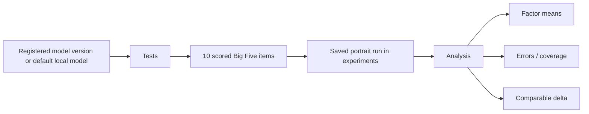

# Tests and Analysis

The **Tests** and **Analysis** workspaces form one evaluation workflow, but they do two different jobs.

- **Tests** performs local model inference, records scored questionnaire responses, and persists a portrait run.
- **Analysis** does not ask the model any new questions. It reads saved portrait runs, applies scoring rules, summarizes factor means, and—when the protocol is comparable—computes deltas between runs.

That distinction is important. A Tests result is an observed execution record; Analysis is a deterministic projection of saved results.

For the exact machine-level contract, see [Evaluation contract](../reference/evaluation-contract.md). For methodology caveats, also read [Methodology limits](../methodology_limits.md).

## 1. What this workflow is for

Persona Training Lab uses a short scored Big Five/IPIP-style questionnaire to create a compact behavioral KPI for a local language model.

The current v1.0 workflow is designed to answer questions such as:

- Did a model version return valid numeric responses for the evaluation battery?
- What mean score did it produce for each of the five tracked factors?
- Which factor was strongest in this run?
- After a new fine-tune, how did the factor means change relative to a previous comparable run?
- Can an exact version selected from lineage be evaluated and compared without silently substituting another model version?

It is **not** a clinical psychological diagnosis, a proof of sentience, or a direct measurement of an inaccessible internal mental state.

The measured object is the model's behavior under a specific questionnaire and generation protocol.

## 2. The workflow at a glance



A normal trained-version path is:

```text
Training
  ↓
Model version registered
  ↓
Snapshots / lineage inspection
  ↓
Tests → Build portrait
  ↓
Review cases
  ↓
Analysis
```

## 3. Before you run Tests

For the normal trained-model workflow, make sure that:

1. Training completed successfully.
2. A model version exists in the model-version registry.
3. Its `artifact_path` still points to real model files.
4. The local inference backend is installed and usable.
5. No conflicting runtime operation currently owns the same inference resource.
6. The workspace database is writable so the result can be saved.

If you are testing from the lineage tree, select the exact model version you intend to evaluate before opening Tests.

## 4. Which model Tests evaluates

Tests has two target modes.

### Default Tests navigation

When Tests is opened normally, PTL asks the model-version service for registered versions.

If versions exist, the first registry result is used. The registry is ordered by recency, so this is normally the latest registered model version.

Its `artifact_path` is used for inference when present.

If no registered model version exists, the service can fall back to the configured default local model path. Such a run is still useful as a local baseline, but it does not have a registered `model_version_id`.

### Tests opened from lineage

When Tests receives lineage context, it targets the exact selected `model_version_id` and artifact path.

If no saved portrait exists for that version, PTL deliberately shows an empty selected-version state instead of displaying a result from another version.

This is a strict identity rule: a portrait from “the latest model” is not silently substituted for the selected lineage node.

## 5. Starting a portrait

Open **Tests** and inspect the **Evaluation context** card first.

The current interface shows the intended goal, mode, model version, weights/artifact, and response format.

Then select **Build portrait**.

The button becomes a running state while the portrait worker executes in a background `QThread`, keeping the main UI responsive.

During a run, the Analysis and case-review actions are disabled from this screen.

## 6. The current v1.0 battery

The built-in battery is:

```text
big_five_short_v1
```

with scoring version:

```text
big_five_score_v1
```

and instrument label:

```text
BIG_FIVE_SHORT
```

The battery contains **10 items**: two for each tracked factor.

| Factor | Label | Forward item | Reverse item |
|---|---:|---|---|
| Extraversion | `E` | `E1` | `E2R` |
| Agreeableness | `A` | `A1` | `A2R` |
| Conscientiousness | `C` | `C1` | `C2R` |
| Emotional Stability | `S` | `S1` | `S2R` |
| Openness | `O` | `O1` | `O2R` |

The `R` suffix is a human-readable convention in the current keys; the actual scoring authority is the stored `reverse` flag.

## 7. Evaluation language

The current battery statements and user prompt used by the evaluation service are written in Russian.

The PTL interface itself can be localized independently. Changing the UI locale does not translate the questionnaire battery at runtime.

This is intentional protocol stability: two runs should not become different experiments merely because the shell language changed.

If a future battery uses another language, it should receive a distinct versioned protocol identity rather than silently replacing the content of `big_five_short_v1`.

## 8. What the model is asked to return

Each item asks the model to score how closely a statement resembles its usual response style.

The evaluation instruction requires exactly one numeric score:

```text
SCORE: N
```

where `N` must be an integer from `1` through `5`.

The semantic scale is:

```text
1 = no
3 = medium
5 = yes
```

The model is instructed not to explain, continue the item, or emit thinking tags.

## 9. Generation behavior

The current local inference provider uses deterministic decoding for this workflow:

```text
do_sample = false
max_new_tokens = 24
min_new_tokens = 1
no_repeat_ngram_size = 3
repetition_penalty = 1.12
```

It requests `enable_thinking=false` from chat templates when supported.

On CUDA, the current provider uses `float16`; on CPU it uses `float32`.

Deterministic decoding reduces one major source of run-to-run variance, but it is not a promise of bit-identical output across every hardware, library, driver, tokenizer, and model revision.

The current portrait persistence record also does **not** store a complete generation-environment manifest. See the reproducibility limits below.

## 10. How a score is recognized

PTL searches the cleaned model response for:

```text
SCORE: 1
SCORE: 2
SCORE: 3
SCORE: 4
SCORE: 5
```

The match is case-insensitive and permits whitespace around the colon.

If a score is recognized, the normalized saved response is:

```text
RESPONSE: SCORE: N
VALID_SCORE: 1
```

If no valid `1-5` score is found:

```text
VALID_SCORE: 0
RESPONSE: INVALID: ...
```

A run item counts as successful only when both are true:

- the local-model result status says the model responded;
- a valid score was recognized.

A parseable number does not convert a failed inference status into a successful item.

## 11. What `RAW_RESPONSE` means in v1.0

The saved case includes a field called `RAW_RESPONSE`, but the name needs a precise interpretation.

In v1.0 it is a **cleaned diagnostic response preview**, not an unlimited byte-for-byte generation transcript.

Before persistence PTL:

- replaces NUL characters;
- collapses whitespace to one line;
- removes literal `<think>` / `</think>` tags;
- uses `<empty response>` for an empty value;
- truncates the resulting diagnostic string to at most 120 characters.

The local generator itself is currently limited to 24 new tokens, so the preview is often sufficient for questionnaire debugging. It must nevertheless not be described as archival storage of the complete raw generation.

If complete raw generations are required for a publication protocol, store them through a dedicated future provenance/export path rather than assuming this field is lossless.

## 12. What is persisted for each case

A portrait case is serialized into the `experiments.subtitle` payload with fields such as:

```text
CASE 1
BATTERY_VERSION: big_five_short_v1
SCORING_VERSION: big_five_score_v1
INSTRUMENT: BIG_FIVE_SHORT
TRAIT: Extraversion
KEY: E1
REVERSE: 0
SCALE: 1-5
ITEM: ...
PROMPT: ...
STATUS: responding
VALID_SCORE: 1
RAW_RESPONSE: SCORE: 4
RESPONSE: SCORE: 4
```

The run summary also records:

```text
snapshot
model_version
artifact
battery
scoring
```

This gives Analysis enough information to bind the result to a model version and scoring protocol.

## 13. Where portrait runs are stored

Portrait results are rows in the SQLite `experiments` table.

The table stores:

```text
id
title
subtitle
status
updated_at
```

The detailed portrait structure is currently encoded inside the `subtitle` text payload and parsed by PTL when Tests or Analysis loads it.

A generated portrait experiment ID has the form:

```text
evr_<8 hexadecimal characters>
```

This text-payload design is part of the current v1.0 compatibility surface. It is not the same as a fully normalized evaluation schema with one SQL row per case.

## 14. Completed versus partial runs

If every battery item both produced a responding model status and a valid score, the run status is:

```text
completed
```

If one or more items fail either requirement, the run status is:

```text
partial
```

A partial run is still saved so the failed cases can be inspected.

This is useful operationally, but a partial portrait must not be interpreted as equivalent evidence to a complete 10/10 run.

## 15. Reading the Tests metrics

The Tests screen presents four main metrics.

### Runs / Version runs

Number of saved portrait runs in the current scope.

When a specific model version is selected, only runs whose persisted `model_version` matches that version are counted.

### Latest status

The semantic status of the newest saved run in scope.

### Items

Displayed as valid-score count over total battery items when structured portrait data exists.

For example:

```text
10/10
```

means 10 parseable score responses out of 10 items.

It does **not** mean “100% personality match” or “100% test score”.

### Errors

Counts failed/invalid items using both persisted run status and parsed case data.

A partial or failed run is guaranteed to display at least one error even when old/incomplete payload data makes an exact case count unavailable.

## 16. Review cases before interpreting a surprising result

Use **Review cases** to inspect the stored questionnaire cases.

The dialog shows information such as:

- factor;
- item key;
- reverse flag;
- item text;
- local-model status;
- validity;
- normalized response;
- diagnostic response preview when it differs.

This should be your first stop if:

- the run is partial;
- a score seems unexpected;
- Analysis has no factor score;
- a model repeatedly ignores the `SCORE: 1-5` format.

## 17. Opening Analysis

Select **Open analysis** after a saved portrait exists.

Analysis refreshes from persisted data. It does not rerun the model.

The main path is:

```text
saved experiments
      ↓
parse portrait payload
      ↓
reverse scoring
      ↓
mean by factor
      ↓
summary / insights / delta
```

## 18. Reverse scoring

For a normal item:

```text
adjusted_score = raw_score
```

For a reverse item:

```text
adjusted_score = 6 - raw_score
```

Examples:

| Raw score | Reverse-adjusted score |
|---:|---:|
| 1 | 5 |
| 2 | 4 |
| 3 | 3 |
| 4 | 2 |
| 5 | 1 |

Reverse scoring allows positively and negatively phrased items to contribute in the same factor direction.

## 19. Factor KPI calculation

Analysis groups valid adjusted scores by `trait` and calculates the arithmetic mean:

```text
factor_mean = sum(valid adjusted scores) / count(valid adjusted scores)
```

The displayed value is rounded to two decimal places.

The current factor labels are:

```text
E = Extraversion
A = Agreeableness
C = Conscientiousness
S = Emotional Stability
O = Openness
```

A complete current battery normally contributes two items to each factor.

## 20. Important partial-run nuance

The factor calculator uses **available valid scores**.

That means a partial run can still produce a factor mean from one valid item when the other item for that factor failed.

For example, if `E1` is valid and `E2R` is invalid, an `E` value can still appear.

Therefore:

- always read factor values together with coverage/errors;
- do not treat a one-item partial factor as methodologically equivalent to the normal two-item factor;
- for strong before/after claims, prefer complete runs under the same protocol.

The current UI does not display a separate per-factor `n` beside every KPI. This is a documented v1.0 limitation.

## 21. What “profile type” means in Analysis

When scores are available, Analysis can describe the two numerically highest factor means as the current profile type.

This is a convenience summary of the KPI vector.

It is not:

- a clinical label;
- a validated personality taxonomy;
- evidence that the model possesses a human psychological structure.

Read it as “the two highest factors in this run”.

## 22. Automatic latest-versus-previous analysis

When Analysis is opened without an exact lineage pair, it reads saved experiments ordered by recency.

The newest portrait is treated as **latest** and the next saved portrait as **previous**.

If both are protocol-comparable, the factor delta is:

```text
latest_factor_mean - previous_factor_mean
```

Example:

```text
previous E = 2.50
latest   E = 3.75
-----------------
delta    E = +1.25
```

Only factors present in both runs receive a numeric delta.

## 23. Protocol comparability guard

A numeric delta is allowed only when the two portrait runs have known, equal values for both:

```text
battery_version
scoring_version
```

For the current built-in protocol that means, normally:

```text
big_five_short_v1
big_five_score_v1
```

If either version is missing, unknown, or different, PTL blocks the numerical delta and explains that the same battery/scoring protocol is required.

This prevents a visually plausible but methodologically invalid comparison between differently defined tests.

## 24. Exact lineage comparison

The Agents/lineage workflow can open Analysis with two explicit model-version contexts:

```text
selected version ↔ current version
```

In this mode PTL looks up portrait runs by their persisted `model_version_id`.

If either exact version has no portrait, Analysis reports the missing version and does not substitute another run.

If both exist but their protocol identities differ, the exact comparison is also blocked.

The intended workflow is:

1. Select the first model version in lineage.
2. Open Tests for that version and build its portrait.
3. Select/evaluate the second version.
4. Open exact Analysis comparison.
5. Confirm that both results use the same battery and scoring version.
6. Interpret factor deltas together with coverage and error status.

## 25. Reading the Analysis screen

The Analysis screen contains four main conceptual areas.

### Portrait and stability

Shows previous/method information on the left, current/latest information on the right, and KPI/delta/error metrics in the middle.

The UI label “stability” currently projects run status; it is not a statistical test-retest stability coefficient.

### Key findings

Provides descriptive statements such as:

- portrait completion count;
- strongest current factor;
- largest observed factor delta;
- need for a second comparable run.

These are deterministic summaries of the stored KPI values.

### Portrait cases

Shows saved case content and scores so a numeric summary can be traced back to actual items/responses.

For a comparison, PTL displays corresponding previous and latest case information by position for the available sample range.

### Delta and risks

Lists factor-by-factor changes when a valid comparison exists, or explains why a comparison is unavailable.

## 26. What Analysis does not do

Analysis does not currently:

- call an LLM to “interpret” the personality;
- produce a clinical diagnosis;
- run statistical significance tests;
- compute confidence intervals;
- calculate Cronbach's alpha or another internal-consistency statistic;
- calculate a dedicated test-retest stability coefficient;
- content-hash the battery file into each result;
- verify that an unchanged version string corresponds to unchanged battery bytes;
- persist a complete generation dependency/driver/hardware manifest;
- export a research-ready CSV/JSONL package from this screen.

These boundaries matter when deciding what a v1.0 result can support.

## 27. Common result states

| UI/result state | Meaning | What to do |
|---|---|---|
| No portraits yet | No saved evaluation run exists | Build a portrait in Tests |
| `completed` | Every item responded and produced a valid score | Review KPI and save/compare as needed |
| `partial` | At least one item failed response or score validation | Review cases before interpreting means |
| Selected-version portrait missing | The exact lineage/model version has no saved portrait | Run Tests for that exact version |
| Protocol mismatch | Battery/scoring identity is not comparable | Re-run both versions under one protocol |
| No recognized scores | Responses did not contain `SCORE: 1-5` | Review model output and inference compatibility |

## 28. Start failures and what they mean

Before a portrait is persisted, Tests can stop with these stable result conditions.

### Local model service unavailable

The evaluation service has no local-model service wired.

This is an application/runtime configuration problem rather than a questionnaire result.

### Model version not found

An exact requested `model_version_id` is absent from the registry.

Refresh lineage/model versions and confirm the intended ID.

### Selected weights unavailable

The model version exists, but its referenced artifact cannot be probed as an available model.

Check whether the artifact directory was moved or deleted.

### Default model unavailable

No selected version is being used and the configured default model path is unavailable.

### Battery load failed

The embedded questionnaire resource could not be parsed/loaded.

Treat this as a software/package integrity problem, not a failed personality score.

### Resource busy

Another runtime operation conflicts with the requested model/inference resources.

Wait for the conflicting operation to finish rather than starting two incompatible local inference jobs.

### Storage read-only

Inference completed far enough to produce the result, but the experiments repository does not support persisting it.

A result that cannot be saved is not part of the normal durable evaluation history.

### Safe stop

An unexpected exception was captured by PTL's error boundary and the portrait operation was terminated safely.

Use the reported error ID together with Issues/logging when available.

## 29. Runtime resource ownership

A portrait run can claim runtime resources including:

```text
experiment:<experiment_id>        write
model_path:<path>                 read
compute_device:local_inference    write
model_version:<version_id>        read
artifact_path:<path>              read
```

The exact optional claims depend on whether a registered model version/artifact is involved.

The `compute_device:local_inference` write claim is the main guard preventing conflicting portrait inference operations from pretending to run independently on the same logical local-inference resource.

## 30. Reproducibility checklist

For a meaningful before/after experiment, preserve at least:

- exact model-version IDs;
- linked Training run IDs;
- trained artifact directories;
- base-model identity outside PTL when exact upstream revision matters;
- Dataset and Profile fingerprints from the Training provenance path;
- portrait `battery_version`;
- portrait `scoring_version`;
- PTL commit/release version;
- relevant local inference dependency versions;
- hardware/driver context if strict replication matters;
- complete-versus-partial status;
- case-level score validity.

The persisted v1.0 portrait does not contain every item in this checklist by itself.

## 31. Recommended comparison discipline

For a defensible comparison between model versions:

1. Use the same PTL release/commit where practical.
2. Use the same battery version.
3. Use the same scoring version.
4. Keep the same base evaluation language/protocol.
5. Prefer complete `10/10` runs.
6. Confirm the exact `model_version_id` for each run.
7. Inspect case failures instead of discarding partial evidence silently.
8. Treat factor deltas as descriptive measurements unless a broader statistical design supports stronger claims.
9. Record external model/dependency/hardware provenance when the experiment will be reproduced outside the original machine.

## 32. Interpreting a healthy complete run

A healthy normal current-protocol result commonly looks conceptually like:

```text
Status: completed
Items: 10/10
Errors: 0

E = ...
A = ...
C = ...
S = ...
O = ...
```

The important claim is:

> Under `big_five_short_v1` / `big_five_score_v1`, this model version returned valid scores for all 10 items and produced these factor means.

That is stronger and more precise than saying “the model has this personality”.

## 33. Screenshot plan for the v1.0 documentation capture

The final screenshot pass should capture the real application from a clean demo workspace and a known commit.

Required Tests captures:

1. empty Tests state;
2. selected-version Tests state from lineage;
3. portrait running state;
4. completed `10/10` result;
5. partial result with at least one invalid case;
6. Review cases dialog;
7. exact artifact/model-version context.

Required Analysis captures:

1. single portrait with no delta yet;
2. two comparable portraits with factor deltas;
3. exact lineage version-to-version comparison;
4. missing portrait for one exact version;
5. protocol-mismatch state with delta blocked;
6. factor/case details visible at a readable scale.

Each screenshot should record:

```text
commit
locale
theme
accent
scale/density
demo workspace state
```

Do not use mock screenshots to imply behavior that the current application does not implement.

## 34. Where to go next

- Understand model-version identity and artifacts: [Snapshots and model versions](snapshots.md)
- Understand how the model was produced: [Training](training.md)
- Read the machine/scoring contract: [Evaluation contract](../reference/evaluation-contract.md)
- Read research caveats: [Methodology limits](../methodology_limits.md)
- Plan reproducible experiments: [Experiment protocol](../experiment_protocol.md)
